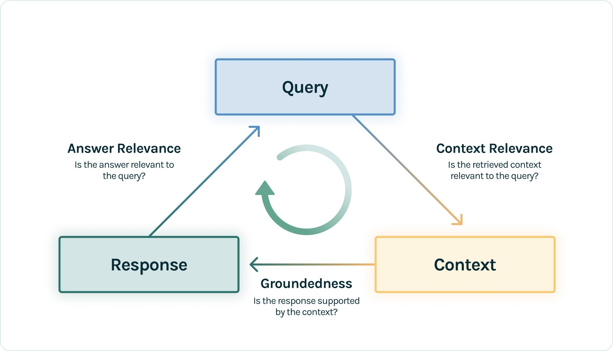
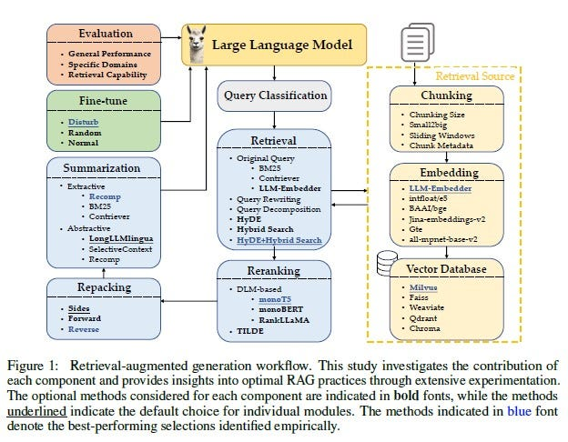

# Experiment: Testing Different RAG Strategies
Inspired by the paper: "Searching for Best Practices in Retrieval-Augmented Generation" by Wang et al. This repository is dedicated to search for the best RAG strategy.
# Evaluation Benchmark
Each RAG strategy was evaluated by Trulens Evaluation Benchmarks: RAG Triad. The RAG triad is made up of 3 evaluations: context relevance, groundedness and answer relevance. Satisfactory evaluations on each provides us confidence that our LLM app is free from hallucination.



# Searching for Best Practices in Retrieval-Augmented Generation

```
@inproceedings{Wang2024SearchingFB,
  title={Searching for Best Practices in Retrieval-Augmented Generation},
  author={Xiaohua Wang and Zhenghua Wang and Xuan Gao and Feiran Zhang and Yixin Wu and Zhibo Xu and Tianyuan Shi and Zhengyuan Wang and Shizheng Li and Qi Qian and Ruicheng Yin and Changze Lv and Xiaoqing Zheng and Xuanjing Huang},
  year={2024},
  url={https://api.semanticscholar.org/CorpusID:270870251}
}
```
